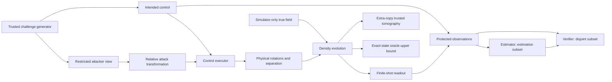

# Adversarial Quantum Sensing

**Control Manipulation Attacks on QML Enhanced NV Magnetometry**

A reproducible, classical-computer proof of concept for one two-level NV Ramsey
magnetometer. It connects physical control errors to density matrices, sampled
measurements, learned representations, estimated fields, and held-out detection.
It makes no assumption that a quantum-inspired learner is more vulnerable or more
secure than a classical or physics-based estimator.

The initial software includes analytical and density-matrix simulation, all six
control attack families, six estimators, randomized sensing challenges, clean
threshold calibration, and executable attack/defense/sensitivity sweeps. A small
optional QuTiP backend models coherent rectangular pulses through a Python API.
There is no sensor network or hardware interface in this release.

## Scientific questions

1. Can phase, timing, or microwave I/Q manipulation cause a controlled field error?
2. Where does the disturbance first appear: state, measurement, representation,
   or estimate?
3. How do measurement, tomography, and exact-state estimators differ?
4. Does secret sensing time obstruct an attacker committed to a nominal schedule?
5. At what information access or challenge latency does that protection disappear?
6. When is spoofing observationally equivalent to a real field change?

## Data flow



`node_id` and unique challenge IDs travel with every control record. A later
trusted reference can produce its own observations and verifier input without
changing single-node state evolution.

## Installation

Use Python **3.10 or later** (verified here with Python 3.11). From the repository:

```bash
python -m venv .venv
source .venv/bin/activate
pip install -e ".[dev]"
pytest
aqs reproduce --output outputs/reproduction
```

Optional rectangular-pulse diagnostic:

```bash
pip install -e ".[pulse]"
```

The core dependencies are NumPy, SciPy, scikit-learn, pandas, matplotlib and PyYAML.
Pytest and Ruff are development dependencies. No quantum processor is needed.

## Quick start and experiments

```bash
# Clean baseline, or any single attack supplied in YAML
aqs simulate --config configs/baseline.yaml
aqs simulate --config configs/randomized_defense.yaml

# Direct phase offsets 0.001–0.1 rad; or targets parameterized in tesla
aqs attack-sweep --config configs/phase_attack.yaml
aqs attack-sweep --config configs/phase_attack.yaml --suite target

# Relative timing errors; preparation and analysis I/Q separately
aqs attack-sweep --config configs/baseline.yaml --suite timing
aqs attack-sweep --config configs/baseline.yaml --suite iq

# Autonomous frequency-reference spoof; deterministic composite
aqs attack-sweep --config configs/baseline.yaml --suite frequency
aqs attack-sweep --config configs/baseline.yaml --suite composite
aqs attack-sweep --config configs/baseline.yaml --suite all

# Fixed, phase-only, random-time, random-time-and-phase, A2 latency, A3, reference A0
aqs defense-sweep --config configs/randomized_defense.yaml

# Shot count, readout error, and T2* sensitivity
aqs sensitivity-sweep --config configs/randomized_defense.yaml

# Fixed-seed baseline + phase + target + defense grids and all ten figure types
aqs reproduce --output outputs/reproduction
```

Output defaults to a new UTC timestamp directory. An explicit existing directory
is rejected, including an incomplete run. Select a new path to rerun. Each sweep
re-trains its learners on the clean distribution for that scenario. The default
reproduction is a small demonstration, not a high-confidence statistical study.

For a quicker integration check, create a YAML file with `train_samples: 16`,
`test_samples: 4`, and `calibration_samples: 8`, then pass `--config` to any command.
Do not interpret 1% false-positive operating points from such small sample counts.

## Model and units

All fields are in **tesla**, times in **seconds**, phases and angles in **radians**,
and detunings in **radians per second**. There is no ambiguous `frequency` or
`detuning_hz` configuration key. The angular gyromagnetic ratio is

$
\gamma=2\pi\times28.025\times10^9\;\mathrm{rad\,s^{-1}\,T^{-1}},\qquad
H_B/\hbar=\gamma B\sigma_z/2.
$

A +Y preparation π/2 pulse maps |0⟩ to +X. Free evolution accumulates γBt.
An equatorial analysis pulse maps the quadrature at α onto Z. The recorded-zero
probability, with symmetric readout error η, is

$
P(0|B,t,\alpha)=\tfrac12[1+(1-2\eta)e^{-(t/T_2^*)^p}\cos(\gamma Bt-\alpha)].
$

The density implementation retains initialization, post-preparation,
preanalysis, and premeasurement states. Dephasing changes the off-diagonal
coherences; readout error changes the outcome distribution only. Instantaneous
pulses allow arbitrary equatorial coherent rotation errors. The analytical
model is the fast ideal-pulse reference and MLE model; experiment state traces
come from the density model.

The two-level Ramsey treatment and angular-frequency convention follow standard
NV sensing practice; see [Arai et al., Nature Communications (2018)](https://www.nature.com/articles/s41467-018-07489-z).
The precise 28.025 GHz/T constant and default noise values here are the project’s
specified simulation parameters, not a fit to that experiment.

```yaml
seed: 20260910
field_min_tesla: 0.0
field_max_tesla: 2.0e-6
sensing_times_seconds: [5.0e-6, 10.0e-6, 20.0e-6, 40.0e-6, 60.0e-6]
analysis_phases_radians: [0.0, 1.5707963267948966]
shots_per_setting: 1000
sensor:
  t2_star_seconds: 100.0e-6
  dephasing_exponent: 1.0
  readout_error: 0.10
attack:
  kind: spoof
  profile: A1
  pulse: analysis
  target_displacement_tesla: 0.1e-6
```

Unknown keys, nonfinite controls, invalid probabilities and negative durations
are rejected. SI naming cannot detect a user typing a microsecond number as
seconds; value provenance and calibration remain the experimenter's responsibility.

## Attacks and attacker knowledge

| Attack `kind` | Physical action | Main qualification |
|---|---|---|
| `phase` | Add `phase_radians` to preparation or analysis | Analysis alone leaves the preanalysis state unchanged |
| `spoof` | Convert desired ΔB into a time-dependent phase | Preparation uses +γΔBt; analysis uses −γΔBt |
| `timing` | `t → t*(1+relative_timing_error)+absolute_seconds` | Relative pulse separation, not wall-clock delay |
| `delay` | Shift entire sequence | No static-field phase change |
| `iq` | Relative phase, rotation scale, Cartesian I/Q gains, detuning | Deterministic coherent errors do not intrinsically mix states |
| `frequency` | Add reference detuning δω, default γΔB | Tracks elapsed time without learning its duration |
| `composite` | Apply `components` in YAML order | Order can matter; intermediate commands are logged |

**Sign convention:** the stated clean formula contains `−α`. Consequently a
literal positive analysis offset `δα=+γΔBt` mimics **B−ΔB**, not B+ΔB.
`target_displacement_tesla` always means the requested *positive or negative
output shift*. A positive target therefore uses a negative analysis phase offset.
Preparation phase enters with the opposite sign. This resolves the sign ambiguity
without changing the Hamiltonian or the requested clean probability.

Timing scales the phase as though the field changed by `B*relative_timing_error`
when dephasing is neglected. At B=0 it creates no magnetic phase, though changing
time still changes coherence and may bias a mismatched estimator.

| Profile | Information available before the control deadline |
|---|---|
| A0 | No schedule; fixed perturbation or explicit reference-time guess |
| A1 | Published nominal schedule; randomized replacements withheld |
| A2 | Current challenge if latency ≤ actuation window; otherwise nominal schedule |
| A3 | Current challenge immediately and downstream control access |

Attacks receive an immutable restricted view and return a relative transformation.
They never receive field truth, density matrices, or unrestricted experiment
configuration. The trusted executor applies transformations to the actual command.
Each invocation logs the view, parameters, before/after commands, commitment and
disclosure times. These are software information boundaries, not an OS sandbox
against malicious Python code.

## Estimation, state access, and verification

| Estimator | Input and role |
|---|---|
| Maximum likelihood | Ideal-pulse binomial model; global alias search and bounded refinement |
| Linear regression | Standardized measurement/challenge features, small ridge penalty |
| RBF kernel ridge | Same measurement/challenge features, nonlinear classical baseline |
| MLP | One 32-unit hidden layer, clean-only supervised training |
| Tomography KRR | Finite-shot preanalysis XYZ reconstruction with trusted extra-copy axes |
| Exact-state KRR | **Oracle upper bound on information access**, using exact preanalysis density matrices |

Exact density matrices are unavailable directly on real NV hardware. Calling this
benchmark an oracle upper bound refers to privileged input, not a guarantee that
its particular kernel regressor outperforms all other models. The default state
kernel is the mean Hilbert–Schmidt overlap across settings. Squared Uhlmann
fidelity is also implemented, exactly once, without a second square. All square
Gram matrices are checked for finite values, symmetry and negative eigenvalues;
regularization is recorded. No previous study or fidelity convention was present
in this empty workspace to reproduce.

The challenge generator supports fixed/uniform/discrete-choice times and phases,
per-setting and per-shot randomization, seeded independent streams, and unique
IDs. Estimators receive the protected intended challenges. The verifier estimates
B on the estimation subset, then evaluates exact binomial NLL and standardized
residuals on a disjoint verification subset. Separate clean validation sequences
calibrate 1% and 5% thresholds. Independent clean and attacked test sequences
produce empirical FPR, TPR, ROC and AUC. Small demonstrations have substantial
sampling uncertainty, especially at 1% FPR.

**Identifiability:** an exact time-following phase spoof produces the same
probabilities as clean observations at B+ΔB. `identifiability.json` checks this for
both pulse surfaces and randomized phases/times. An output-only detector cannot
distinguish these hypotheses. Detection requires a challenge the attacker cannot
follow, independent control evidence, a trusted reference, or another physical
constraint. Phase randomization alone does not prevent relative phase injection.
Even time secrecy fails against an autonomous frequency offset in this model.

## Outputs and reproducibility

Each run saves a machine-readable manifest, package/platform versions, command,
resolved per-scenario YAML, SeedSequence identities, predictions and truth for
offline evaluation, clean calibration scores, detector ROC/threshold metrics,
kernel diagnostics, runtime, complete test control/count audits, and compressed
four-boundary density traces. Output hashes are in the completed manifest.

Figures have labeled units and JSON companion captions referencing the exact
configurations: clean estimates, phase errors, target success, efficacy versus
detection, ROC, fixed/random comparison, latency, state disturbance, kernel
distortion, and clean accuracy cost. A command produces only the views relevant
to its scenarios; full reproduction produces all ten. Generated data are ignored
by version control. Reproducibility means identical seeded numeric results in a
matching environment, not identical timestamps or compressed-file metadata.

```bash
pytest
ruff check .
ruff format --check .
aqs reproduce --output outputs/reproduction-repeat
```

The tests check scientific invariants, finite-shot behavior, coherent I/Q errors,
capability boundaries, estimator input restrictions, global-delay invariance,
time-secrecy ablation, kernel conventions, all learners, and overwrite protection.
The optional pulse test skips when QuTiP is absent.

## Scope, limitations, and next steps

This is a two-level, static-field simulation with known calibration, independent
binomial readout, deterministic control attacks and free-evolution dephasing.
There is no hyperfine structure, leakage, real optical count model, calibration
drift, stochastic I/Q channel, hardware measurement, or distributed sensor network.
Tomography assumes additional identically prepared copies and trusted readout axes;
per-shot tomography is a conceptual repeated-copy diagnostic, not observation of
one unknown state without disturbing it. The simple learners are benchmarks with
fixed hyperparameters, not optimized claims of quantum advantage.

Next: add physical pulse envelopes and dissipation to the optional backend;
model optical counts and calibration uncertainty; validate against hardware;
then supply independently trusted node observations to an evidence-fusing verifier.
That extension belongs outside single-node state evolution. For research-scale
evaluation, add nested hyperparameter selection, more calibration/test sequences,
multiple independent seeds and uncertainty intervals on detector rates.

Detailed specifications: [architecture](docs/architecture.md),
[physics](docs/physics_model.md), [threat model](docs/threat_model.md),
[experiment protocol](docs/experiment_protocol.md),
[result schema](docs/results_schema.md), and [limitations](docs/limitations.md).

The [initial verification report](docs/verification.md) records executed checks,
measured results, and the interpretation limits of the default-seed demonstration.
